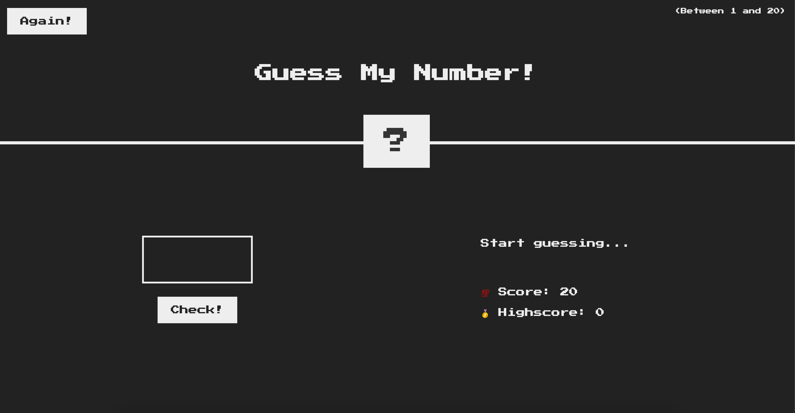
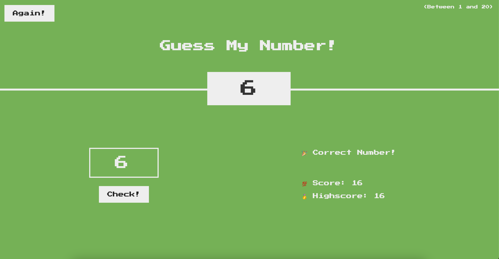

# 🎲 Guess My Number Game 🎲

Welcome to the Guess My Number game! 🚀 In this interactive game, you have to guess the secret number chosen by the computer. Can you guess it correctly?

## How to Play

1. The computer will randomly select a secret number between a specified range.
2. You have to guess the secret number by entering your guess in the input field.
3. Click the "Check" button to see if your guess is correct.
4. The game will provide feedback on your guess, letting you know if the secret number is higher or lower.
5. Keep guessing until you find the secret number!

## Try the Live Demo

Check out the live demo of the Guess My Number game [here](https://morohoschidanieli.github.io/guess-my-number-game/). 🌐

## Screenshots

## Technologies Used

The Guess My Number game is built using the following technologies:

- HTML, CSS, and JavaScript: For creating the user interface and game logic.
